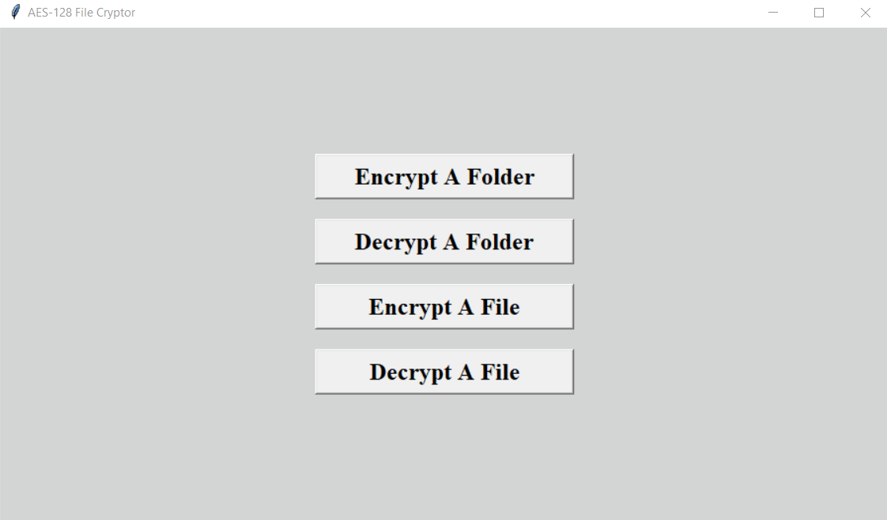

# AES-128 File Cryptor (Graphical User Interface)
## This application, makes AES-128 encryption and decryption, of files and/or entire folders, quick and easy.

#### The Windows "AES-128 File Cryptor.exe" file, has all it's requirements bundled with it, so nothing needs to be installed, for Windows.
#### For Linux and Mac, the "AES-128 File Cryptor.pyw" file, can be used, with the latest Python installed, you can compile it, on your own.
#### The Windows "AES-128 File Cryptor.exe" file is unsigned, as it costs money to sign an application, therefor, it may trigger a smartscreen warning, in Windows. The application is safe and the source code is available to review for yourself, in the "AES-128 File Cryptor.pyw" file, as well as, the "src" directory, where the functions and classes are stored and are commented, to explain their usage.
#### You can compile the application yourself, using Python's "PyInstaller", for Windows, Mac, and Linux. If you compile the "AES-128 File Cryptor.exe" file, with PyInstaller, in Windows, on your own system, you will not get a smartscreen warning, when using the "AES-128 File Cryptor.exe" file.
#### To install "PyInstaller":
1.) Install Python (If not already installed) \
2.) ```pip install pyinstaller```
