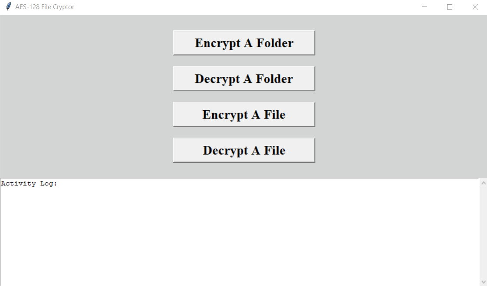
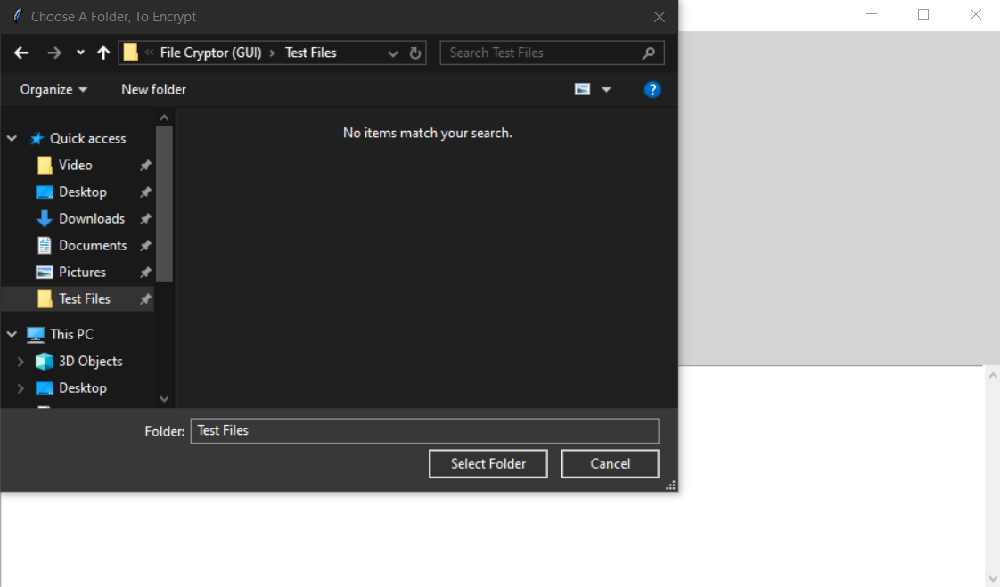
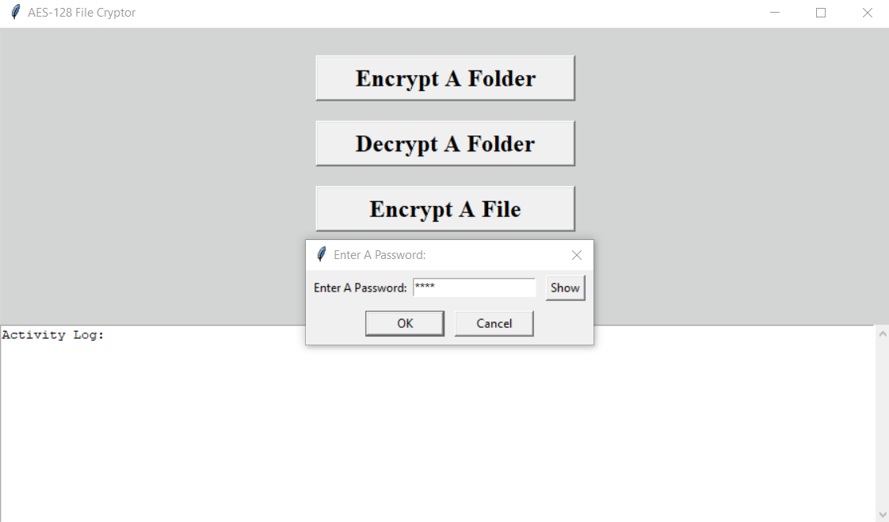

# AES-128 File Cryptor (Graphical User Interface)


## This application, makes AES-128 encryption and decryption, of files and/or entire folders, quick and easy.





## How To Use (Windows):
#### The pre-compiled "AES-128 File Cryptor.exe" file, has all of it's requirements bundled with it, so no requirements, will need to be installed, just download and use. 
#### PLEASE NOTE: The pre-compiled "AES-128 File Cryptor.exe" file, is unsigned, as it costs money to sign an application, therefor, it may trigger a smartscreen warning, on the first use, but it should not afterward, and it should not trigger a Defender or anti-virus warning (Just click "More info", then "Run anyway", to skip the smartscreen warning, on the first use. To review the application's source code, use an editor to open the "AES-128 File Cryptor.pyw" file, as well as, the functions and classes, in the "src" directory. The functions and classes, are commented clearly, to explain each of their usage parameters and what they return.
## How To Use (Linux and Mac):
#### The "AES-128 File Cryptor.pyw" file, can be used with the latest Python installed. You can also compile it, with "PyInstaller" (See below), to create a system-specific executable (See below).
## To Install "PyInstaller":
1.) Install Python (If not already installed) \
2.) Shellcode: ```pip install pyinstaller```
#### To Compile "AES-128 File Cryptor" Yourself (Windows, Mac, and Linux):
1.) Open a shell prompt and change directory, to this file's directory, before entering the following shellcode \
2.) Shellcode: ```python -m PyInstaller --onefile --windowed --icon=assets/lock.ico "AES-128 File Cryptor.pyw"```
