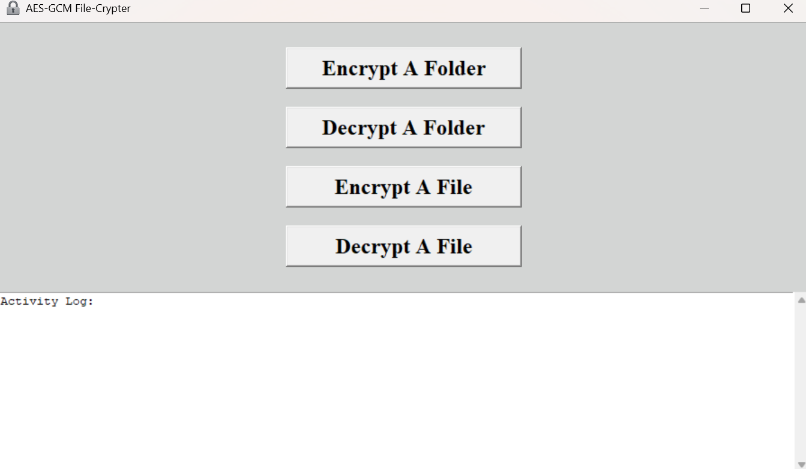
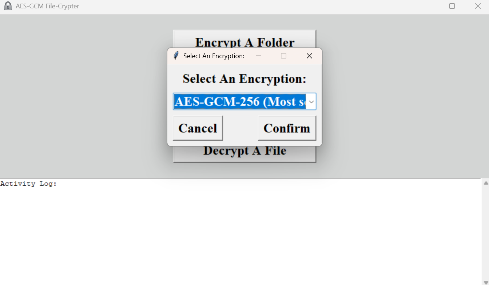
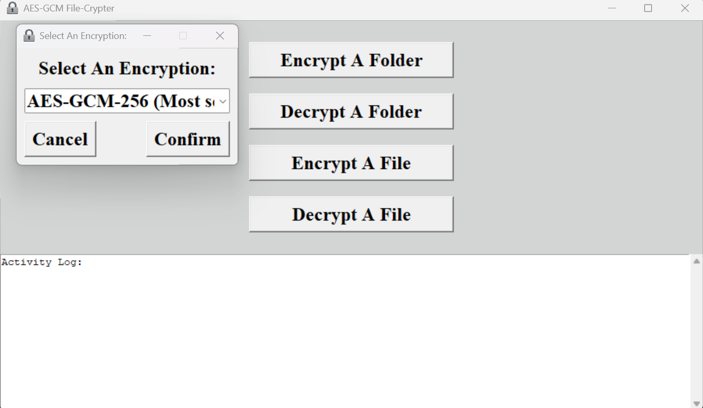

# AES-GCM File-Crypter (Graphical User Interface)
## This application, makes AES-GCM (128, 192, or 256 bit) encryption/decryption, of files and/or entire folders, quick and easy, for Windows, Linux, And Mac.

## What is AES-GCM?
### AES-GCM, is the most secure and modern approach for encryption/decryption.

## Usage:
1.) Pick encryption/decryption options \
2.) Enter the password \
3.) Encrypt/decrypt a file or an entire folder




## Setup (Windows):
### The pre-compiled "AES-GCM File-Crypter.exe" file, has all of it's requirements bundled with it, so no requirements are needed, just download and use.
### To Compile "AES-GCM File-Crypter" Yourself (Windows, Linux, And Mac):
1.) Open a shell prompt and change directory, to this file's directory, before entering the following shellcode \
2.) ```python -m PyInstaller --onefile --windowed --icon=assets/icon/ico/256x256.ico "AES-GCM File-Crypter.pyw"```
