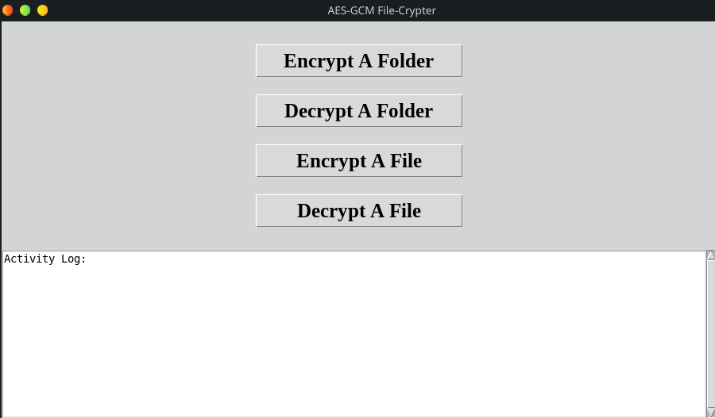
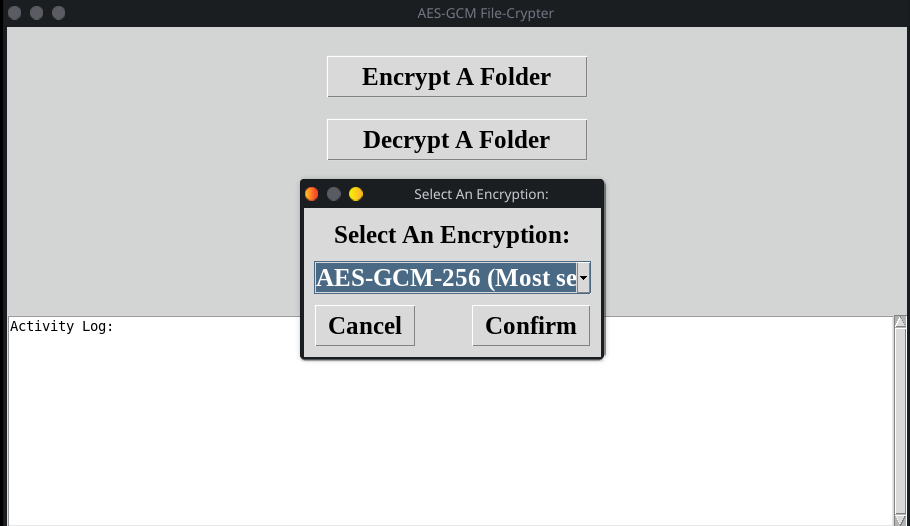

  
<br></br>

# AES-GCM File-Crypter (Graphical User Interface)  

## What Does This Application Do?
This application, makes AES-GCM cryptography of files and/or entire folders, quick and easy for Windows and Linux.  

## What Is AES-GCM?
AES-GCM, is the most secure and modern approach for encryption/decryption and has 3 options (128, 192, and 256 bit).  
<br></br>

## Windows Version ("dist/windows" folder):  
</br>


### 1.) Pick encryption/decryption options

### 2.) Enter the password

### 3.) Encrypt/decrypt a file or an entire folder
  
<br></br>

## Linux Version ("dist/linux" folder):  
</br>


### 1.) Pick encryption/decryption options

### 2.) Enter the password

### 3.) Encrypt/decrypt a file or an entire folder
    
<br></br>

## Compile, Yourself (Optional):  

### Windows
1.) Make sure the latest python, PyInstaller, and any missing requirements are installed, \
then open a terminal and change directory to this file's directory, before entering the following shellcode \
2.) ```python -m PyInstaller --clean --noconfirm --onefile --windowed --icon=assets/icon/ico/icon.ico --add-data "assets;assets" "AES-GCM File-Crypter.pyw"```  

### Linux:
1.) Make sure the latest python, PyInstaller, and any missing requirements are installed, \
then open a terminal and change directory to this file's directory, before entering the following shellcode \
2.) ```python -m PyInstaller --clean --noconfirm --onefile --windowed --icon="assets/icon/ico/icon.ico" --add-data "assets:assets" --hidden-import=_cffi_backend --collect-binaries cffi --collect-data cffi "AES-GCM File-Crypter.pyw"```
