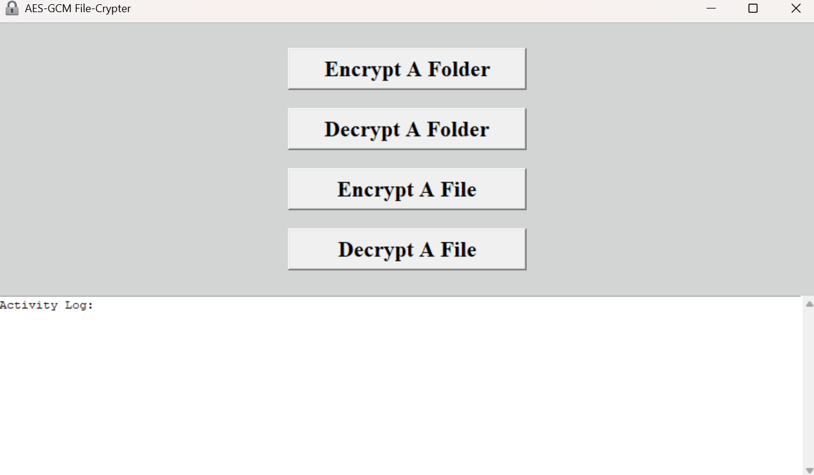
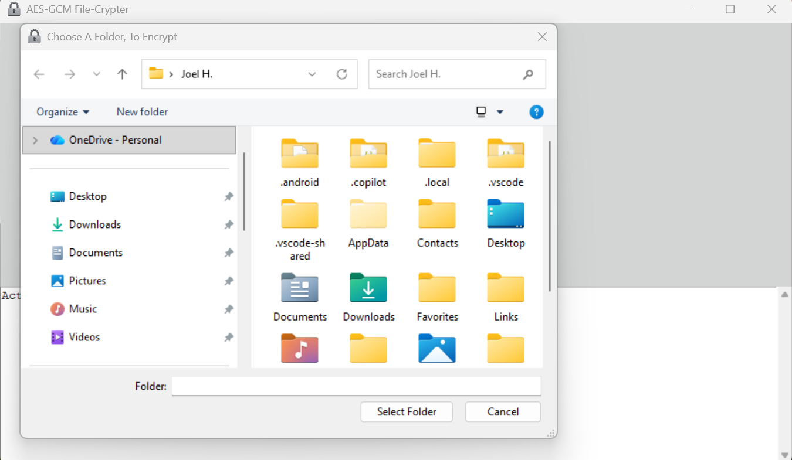
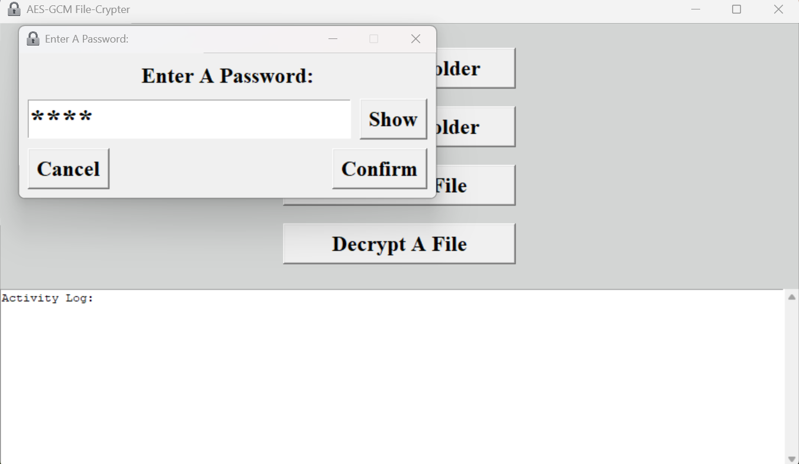

  
<br>
# AES-GCM File-Crypter (Graphical User Interface)
## This application, makes AES-GCM cryptography of files and/or entire folders, quick and easy for Windows and Linux.  
<pre>

</pre>
## What Is AES-GCM?
AES-GCM, is the most secure and modern approach for encryption/decryption and has 3 options (128, 192, and 256 bit).  
<pre>

  
</pre>
## Windows Version Previews:



  
<pre>

  
</pre>
## Setup (Windows):
#### No setup is required, the pre-compiled "AES-GCM File-Crypter.exe" file, has all of it's requirements bundled with it, just download and use.  

## Setup (Linux):
#### No setup is required, the pre-compiled "AES-GCM File-Crypter.bin" file, has all of it's requirements bundled with it, just download and use.  
<pre>

  
</pre>
## Usage:
1.) Pick encryption/decryption options \
2.) Enter the password \
3.) Encrypt/decrypt a file or an entire folder  
<pre>

  
</pre>
## Compile, Yourself, On Windows (Optional):
1.) Make sure the latest python, PyInstaller, and any missing requirements are installed, \
then open a terminal and change directory to this file's directory, before entering the following shellcode \
2.) ```python -m PyInstaller --clean --noconfirm --onefile --windowed --icon=assets/icon/ico/icon.ico --add-data "assets;assets" "AES-GCM File-Crypter.pyw"```  

## Compile, Yourself, On Linux (Optional):
1.) Make sure the latest python, PyInstaller, and any missing requirements are installed, \
then open a terminal and change directory to this file's directory, before entering the following shellcode \
2.) ```python -m PyInstaller --clean --noconfirm --onefile --windowed --icon="assets/icon/ico/icon.ico" --add-data "assets:assets" --hidden-import=_cffi_backend --collect-binaries cffi --collect-data cffi "AES-GCM File-Crypter.pyw"```
