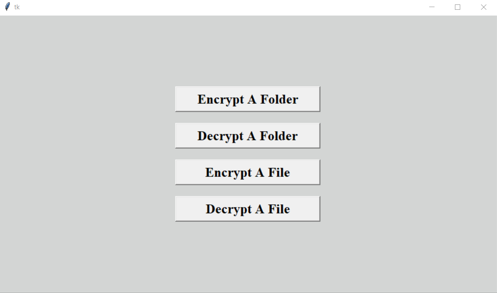
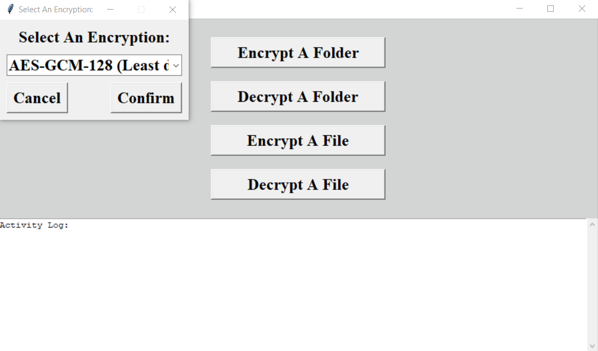
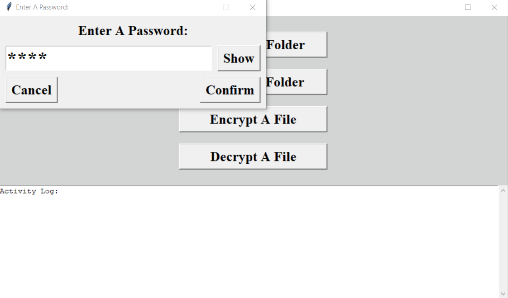

# AES-GCM File Cryptor (Graphical User Interface)
## This application, makes AES-GCM 128, 192, or 256 bit encryption and decryption, of files and/or entire folders, quick and easy.
## How To Use:
#### 1.) Pick encryption/decryption options
#### 2.) Enter the password
#### 3.) Encrypt/decrypt a file or an entire folder
#



#
## Setup (Windows):
#### The pre-compiled "AES-GCM File Cryptor.exe" file, has all of it's requirements bundled with it, so no requirements, will need to be installed, just download and use.
## Setup (Linux and Mac):
#### The "AES-GCM File Cryptor.pyw" file, can be used with the latest Python installed. You can also compile it, with "PyInstaller" (See below), to create a system-specific executable (See below).
## To Install "PyInstaller":
1.) Install Python (If not already installed) \
2.) Shellcode: ```pip install pyinstaller```
#### To Compile "AES-GCM File Cryptor" Yourself (Windows, Mac, and Linux):
1.) Open a shell prompt and change directory, to this file's directory, before entering the following shellcode \
2.) Shellcode: ```python -m PyInstaller --onefile --windowed --icon=assets/favicon.ico "AES-GCM File Cryptor.pyw"```
